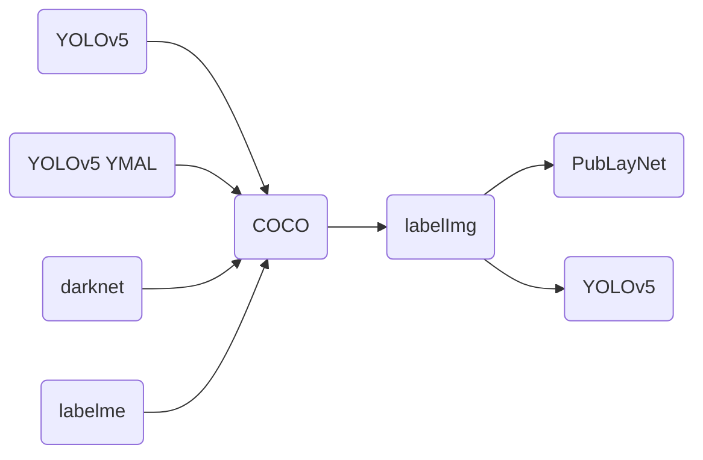

<div align="center">
  <div align="center">
    
  </div>
  <br/>

  <a href="">=3.6,<3.12-aff.svg"></a>
  <a href=""></a>
  <a href="https://github.com/RapidAI/LabelConvert/graphs/contributors"></a>
  <a href="https://github.com/RapidAI/LabelConvert/stargazers"></a>
  <a href="https://pepy.tech/project/label_convert"></a>
  <a href="https://pypi.org/project/label_convert/"></a>
  <a href="https://choosealicense.com/licenses/apache-2.0/"></a>
  <a href="https://semver.org/"></a>
  <a href="https://github.com/psf/black"></a>

</div>

目标检测和图像分割的数据集格式转换工具，支持**labelme、labelImg与YOLO、VOC和COCO** 数据集格式之间的相互转换。


### 支持的转换


### 安装
```bash {linenos=table}
pip install label_convert
```

